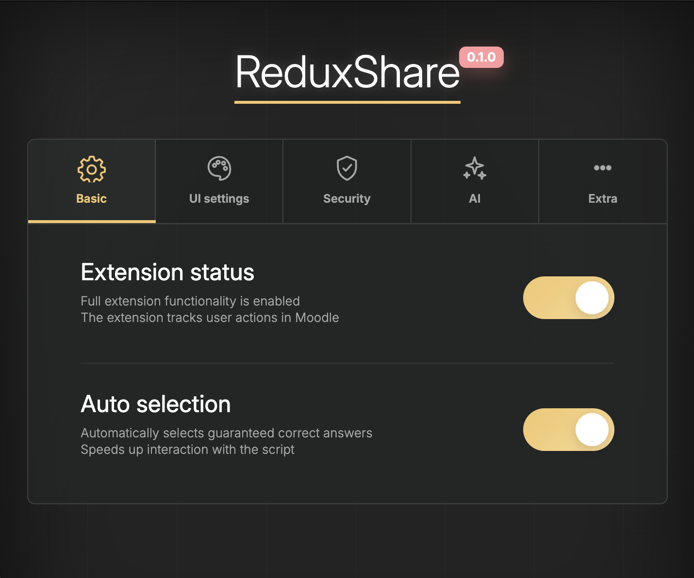
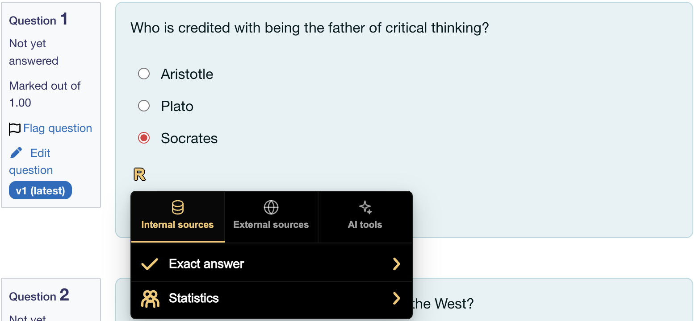

<p align="center">
  
</p>
<h1 align="center">ReduxShare</h1>

<p align="center">
  Browser extension for Moodle quizzes with shared answer statistics, review imports, and AI-assisted solving.
</p>
<p align="center">
  
  
  
  
</p>
<p align="center">
  
</p>
<p align="center">
  <strong>🇺🇸 English</strong>
  ·
  <a href="README.ru.md">🇷🇺 Русский</a>
</p>


<p align="center">
  <a href="#about">About</a>
  ·
  <a href="#preview">Preview</a>
  ·
  <a href="#how-it-works">How it works</a>
  ·
  <a href="#features">Features</a>
  ·
  <a href="#installation">Installation</a>
  ·
  <a href="#configuration">Configuration</a>
  ·
  <a href="#quick-start">Quick start</a>
  ·
  <a href="#development">Development</a>
  ·
  <a href="#privacy">Privacy</a>
  ·
  <a href="#license">License</a>
</p>
---

## About

**ReduxShare** is a Moodle-focused browser extension for quiz review and answer analysis. It displays contextual answer widgets, aggregates shared answer statistics, imports quiz review data, and supports optional AI-assisted suggestions.

Built with **TypeScript**, **React**, **Vite**, and **Supabase**.

ReduxShare is not affiliated with Moodle, Supabase, Google, or any Moodle instance.

---

## Preview

### Extension window

<p align="center">
  
</p>

### Extension working window

<p align="center">
  
</p>

---

## How it works

ReduxShare runs as a Manifest V3 browser extension on Moodle quiz pages.

1. **Attempt page detection**
   On Moodle `attempt.php` pages the content script scans visible quiz questions, detects Moodle question types, builds stable question hashes, and mounts compact `R` widgets near the relevant answer controls.

2. **Answer lookup**
   The extension asks two answer sources for matching variants:
   - **Internal sources**: Supabase data imported from previous Moodle review pages.
   - **External sources**: external-compatible answer data from the configured background provider.

3. **ReduxShare menu**
   Clicking `R` opens a shadow-DOM menu with available tabs:
   - **Internal sources** for verified answers and shared statistics.
   - **External sources** for external results.
   - **AI tools** when AI is supported for the Moodle question type and configured in settings.

4. **Correctness handling**
   Verified review answers are saved as exact answers and may be auto-applied. Hidden-review or uncertain answers are saved as statistics only and are not used as confirmed correct answers.

5. **Review import**
   On Moodle `review.php` pages ReduxShare parses right-answer blocks, selected answers, per-slot controls, and supported drag/drop metadata, then sends the normalized payload to the background worker for storage.

6. **Auto-apply**
   When exact answers are available, ReduxShare can fill Moodle controls automatically. The implementation is type-aware: choice questions, text inputs, matching, Cloze/multianswer, ordering, and drag/drop types use separate application logic.

7. **Update checks**
   The background worker checks the GitHub `.VERSION` file and compares it with the installed manifest version. When a newer version is available, the popup header shows a **New update** badge.

---

## Features

- **Open-source project** under the [GPL-3.0 license](LICENSE).

- **AI-Assisted Answers** — generate optional answer suggestions with configurable AI providers.

- **Moodle Native** — works directly on Moodle quiz attempt and review pages.

- **Inline answer widgets** — displays answer data next to quiz questions.

- **Shared answer statistics** — shows aggregated answers collected from previous attempts from other users.

- **Review import** — imports answer data from Moodle quiz review pages.

- **Auto matching** — provides correct answers automatically.

- **Correctness-aware matching** — separates confirmed correct answers, unknown selections, and shared statistics.

- **Customizable** — supports theme accents, popup settings, stealth mode, and hotkey options.

- **Manifest V3 Ready** — built as a modern Chrome Extension using MV3 APIs.

- **Modern frontend stack** — built with **TypeScript**, **React**, and **Vite**.

- **Moodle question type coverage** — supports the common Moodle quiz types listed below.

  | Task Type                    | DOM name           | Support | Internal Sources | External Sources | AI Tools |
  | :--------------------------- | :----------------- | :-----: | :--------------: | :--------------: | :------: |
  | Calculated                   | `calculated`       |    ✅    |        ✅         |        🔴         |    ✅     |
  | Calculated multi-choice      | `calculatedmulti`  |    ✅    |        ✅         |        🔴         |    ✅     |
  | Calculated simple            | `calculatedsimple` |    ✅    |        ✅         |        🔴         |    ✅     |
  | Drag and drop into text      | `ddwtos`           |    ✅    |        ✅         |        🔴         |    ✅     |
  | Drag and drop markers        | `ddmarker`         |    🟡    |        ✅         |        🔴         |    🔴     |
  | Drag and drop onto image     | `ddimageortext`    |    🟡    |        ✅         |        🔴         |    🔴     |
  | Essay                        | `essay`            |    🟡    |        🔴         |        🔴         |    ✅     |
  | Matching                     | `match`            |    ✅    |        ✅         |        ✅         |    ✅     |
  | Embedded answers / Cloze     | `multianswer`      |    ✅    |        ✅         |        ✅         |    ✅     |
  | Multiple choice              | `multichoice`      |    ✅    |        ✅         |        ✅         |    ✅     |
  | Ordering                     | `ordering`         |    ✅    |        ✅         |        🔴         |    ✅     |
  | Short answer                 | `shortanswer`      |    ✅    |        ✅         |        ✅         |    ✅     |
  | Numerical                    | `numerical`        |    ✅    |        ✅         |        ✅         |    ✅     |
  | Random short-answer matching | `randomsamatch`    |    ✅    |        ✅         |        ✅         |    ✅     |
  | Select missing words         | `gapselect`        |    ✅    |        ✅         |        ✅         |    ✅     |
  | True/False                   | `truefalse`        |    ✅    |        ✅         |        ✅         |    ✅     |

---

## Installation

### From source

Requirements:

- Node.js 20 or newer
- npm
- Chromium-based browser such as Chrome, Edge, Brave, or Chromium
- Supabase project credentials if you want internal ReduxShare sources to work

Install dependencies:

```bash
npm install
```

Create a local environment file:

```bash
cp .env.example .env
```

Set your Supabase values in `.env`:

```bash
VITE_SUPABASE_URL=https://your-project-ref.supabase.co
VITE_SUPABASE_ANON_KEY=your-supabase-publishable-or-anon-key
```

Do not commit `.env`. Only `.env.example` should be stored in Git.

Build the extension:

```bash
npm run build
```

Load it in the browser:

1. Open `chrome://extensions` or the equivalent extensions page in your browser.
2. Enable **Developer mode**.
3. Click **Load unpacked**.
4. Select the generated `dist` directory.
5. Pin ReduxShare from the browser toolbar if needed.

### Development build

For local development, run:

```bash
npm run dev
```

Use `npm run build` before loading or reloading the production extension from `dist`.

## Configuration

### Supabase

ReduxShare uses Supabase for authentication, user profile state, quiz progress, and internal answer storage. The extension expects the public Supabase URL and publishable/anon key at build time:

```bash
VITE_SUPABASE_URL=https://your-project-ref.supabase.co
VITE_SUPABASE_ANON_KEY=your-supabase-publishable-or-anon-key
```

Database schema and RPC definitions live in `supabase/migrations/`. Runtime code uses RPC calls instead of direct table writes for shared quiz data.

### AI

AI tools are optional. Google Gemini is supported through the popup settings screen. API keys are stored in browser extension storage and are only used for requests initiated by ReduxShare.

AI tools are disabled for question types where text-only context is not reliable enough, such as `ddmarker` and `ddimageortext`.

### Updates

Keep these versions aligned before release:

- `.VERSION`
- `package.json` `version`
- `public/manifest.json` `version`

The extension checks the GitHub raw `.VERSION` file and links users to the latest GitHub release when an update is available.

## Quick start

1. Install or build the extension and load the `dist` directory as an unpacked browser extension.

2. Open the ReduxShare popup and sign in with your Supabase-backed ReduxShare account.

3. Open a Moodle quiz attempt page:

```text
https://your-moodle.example/mod/quiz/attempt.php?...
```

4. Wait for `R` widgets to appear near supported Moodle question controls.

5. Click an `R` widget:
   - Use **Internal sources** for ReduxShare saved answers and statistics.
   - Use **External sources** for external-compatible answers.
   - Use **AI tools** only after configuring an AI provider in settings.

6. To import confirmed answers, finish or submit the quiz, open the Moodle review page, and let ReduxShare parse and save the review data:

```text
https://your-moodle.example/mod/quiz/review.php?...
```

7. Run local verification before changing extension logic:

```bash
npm run typecheck
npm run test
npm run build
```

After build changes, reload the unpacked extension from the browser extensions page.

## Development

Use the local test matrix for DOM parsing, answer menu behavior, auto-apply logic, AI payload handling, and update checks:

```bash
npm run typecheck
npm run test
npm run build
```

For live Supabase save checks, provide test credentials in the environment and run:

```bash
npm run test:db
```

After every production build, verify that the Moodle content script remains a classic bundled script without top-level imports:

```bash
rg -n "^(import|export)\b|import\(" dist/assets/quizAttempt.js
```

The command should return no matches.

## Privacy

ReduxShare is designed to work with Moodle quiz pages and may process quiz-related data required for its features.

Depending on the enabled features, the extension may handle:

- Moodle domain
- Course and quiz identifiers
- Question identifiers
- Question type metadata
- Answer variants
- Quiz review data
- Shared answer statistics
- Extension settings
- Authentication state

ReduxShare does not need access to unrelated browsing history to provide its core functionality. The manifest only targets Moodle quiz attempt, summary, and review URLs for content scripts.

Depending on enabled features and configuration, ReduxShare may contact:

- your configured Supabase project;
- the external answer provider;
- GitHub raw content for update checks;
- Google Gemini or a custom AI endpoint when AI tools are enabled.

AI suggestions are optional. When enabled, the question content and relevant answer options may be sent to the selected AI provider in order to generate a response.

**<u>Do not enable AI suggestions if you do not want quiz content to be processed by an external AI provider.</u>**

API keys for AI providers are stored in the browser extension storage and are used only for requests initiated by the extension.

---

## License

This project is licensed under the **GNU General Public License v3.0**.

The GPL-3.0 license permits use, study, modification, and distribution of the source code under its terms.

See the [LICENSE](LICENSE) file for the full license text.
