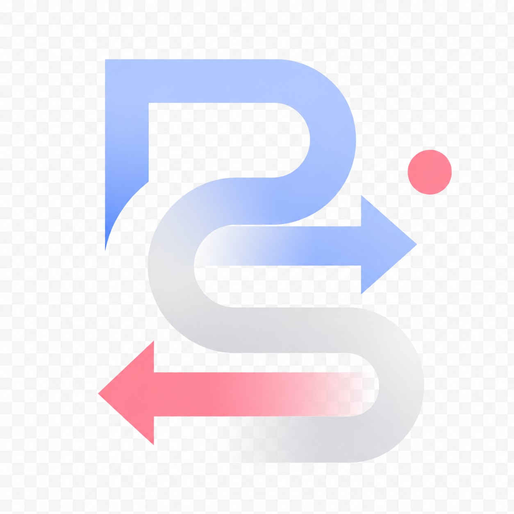
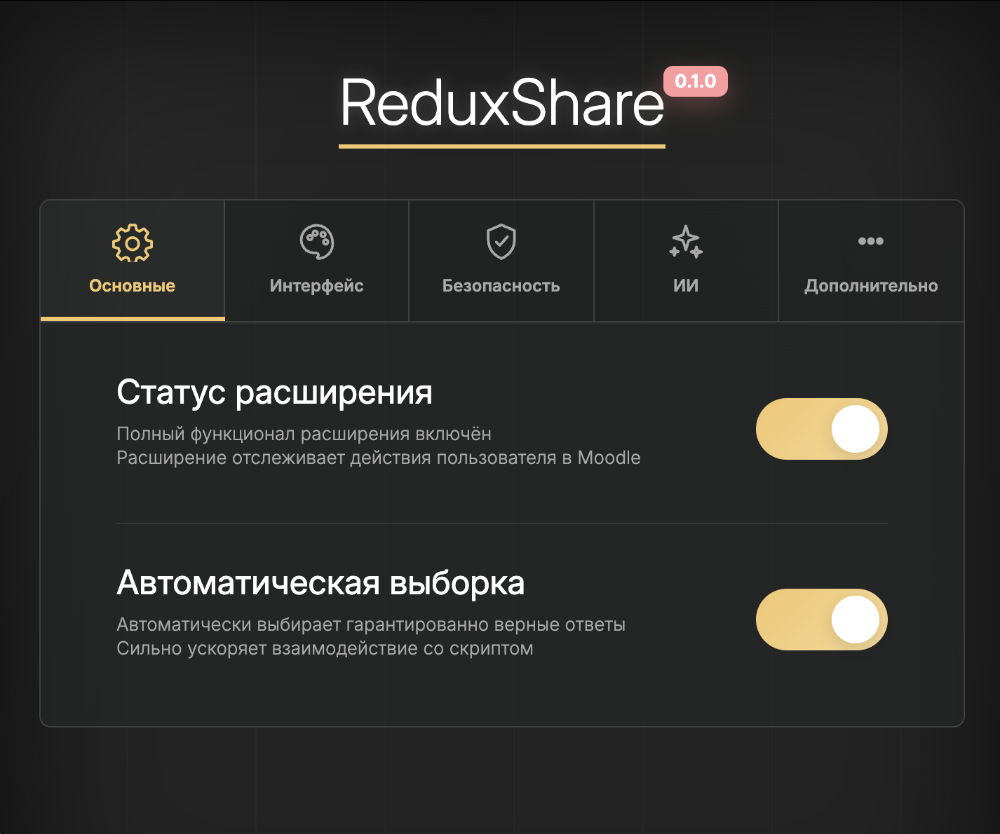
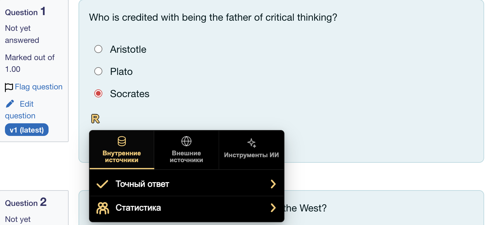

<p align="center">
  
</p>
<h1 align="center">ReduxShare</h1>

<p align="center">
  Браузерное расширение для тестов Moodle: общая статистика ответов, импорт проверок и помощь ИИ.
</p>
<p align="center">
  
  
  
  
</p>

<p align="center">
  
</p>
<p align="center">
  <a href="README.md">🇺🇸 English</a>
  ·
  <strong>🇷🇺 Русский</strong>
</p>


<p align="center">
  <a href="#о-проекте">О проекте</a>
  ·
  <a href="#превью">Превью</a>
  ·
  <a href="#как-это-работает">Как это работает</a>
  ·
  <a href="#возможности">Возможности</a>
  ·
  <a href="#установка">Установка</a>
  ·
  <a href="#настройка">Настройка</a>
  ·
  <a href="#быстрый-старт">Быстрый старт</a>
  ·
  <a href="#разработка">Разработка</a>
  ·
  <a href="#приватность">Приватность</a>
  ·
  <a href="#лицензия">Лицензия</a>
</p>

---

## О проекте

**ReduxShare** — браузерное расширение для Moodle, которое помогает анализировать ответы в тестах. Оно показывает виджеты ответов рядом с вопросами, собирает общую статистику, импортирует данные со страниц проверки и поддерживает необязательные подсказки ИИ.

Проект построен на **TypeScript**, **React**, **Vite** и **Supabase**.

ReduxShare не связан с Moodle, Supabase, Google или какой-либо конкретной платформой Moodle.

---

## Превью

### Окно расширения

<p align="center">
  
</p>

### Работа расширения на странице Moodle

<p align="center">
  
</p>

---

## Как это работает

ReduxShare работает как расширение Manifest V3 на страницах тестов Moodle.

1. **Определение страницы попытки**
   На страницах Moodle `attempt.php` скрипт расширения сканирует видимые вопросы, определяет типы заданий Moodle, строит стабильные хэши вопросов и размещает компактные виджеты `R` рядом с нужными полями ответа.

2. **Поиск ответов**
   Расширение запрашивает подходящие варианты из двух источников:
   - **Внутренние источники**: данные Supabase, импортированные с предыдущих страниц проверки.
   - **Внешние источники**: совместимые внешние данные из настроенного фонового обработчика.

3. **Меню ReduxShare**
   При клике на `R` открывается изолированное меню с доступными вкладками:
   - **Внутренние источники** для подтверждённых ответов и общей статистики.
   - **Внешние источники** для внешних результатов.
   - **Инструменты ИИ**, если тип задания поддерживается и ИИ настроен.

4. **Учёт уверенности**
   Подтверждённые ответы со страниц проверки сохраняются как точные и могут применяться автоматически. Ответы из скрытой проверки или ответы без подтверждения сохраняются только как статистика и не используются как верные.

5. **Импорт проверки**
   На страницах Moodle `review.php` ReduxShare разбирает блоки правильных ответов, выбранные ответы, элементы по позициям и данные поддерживаемых заданий с перетаскиванием, затем отправляет нормализованные данные в фоновый обработчик для сохранения.

6. **Автозаполнение**
   Когда доступны точные ответы, ReduxShare может автоматически заполнить элементы Moodle. Логика учитывает тип задания: варианты выбора, текстовые поля, сопоставление, вложенные ответы, сортировка и задания с перетаскиванием обрабатываются отдельно.

7. **Проверка обновлений**
   Фоновый обработчик проверяет файл `.VERSION` на GitHub и сравнивает его с установленной версией расширения. Если доступна новая версия, в верхней части окна расширения появляется плашка **Новое обновление**.

---

## Возможности

- **Проект с открытым исходным кодом** под лицензией [GPL-3.0](LICENSE).

- **Помощь ИИ** — необязательная генерация подсказок через настраиваемых поставщиков ИИ.

- **Работа прямо в Moodle** — расширение работает на страницах попытки и проверки теста Moodle.

- **Встроенные виджеты ответов** — показывает данные ответов рядом с вопросами.

- **Общая статистика ответов** — отображает агрегированные ответы, собранные с предыдущих попыток других пользователей.

- **Импорт проверок** — импортирует данные ответов со страниц проверки Moodle.

- **Автозаполнение** — автоматически применяет найденные точные ответы.

- **Учёт статуса ответа** — разделяет подтверждённо верные ответы, неизвестные выбранные ответы и общую статистику.

- **Настройка интерфейса** — поддерживает цветовой акцент, настройки окна расширения, скрытый режим и горячую клавишу.

- **Manifest V3** — современное расширение Chrome на API MV3.

- **Современный стек интерфейса** — **TypeScript**, **React** и **Vite**.

- **Покрытие типов заданий Moodle** — поддерживаются распространённые типы заданий Moodle.

  | Тип задания                         | DOM-имя            | Поддержка | Внутренние источники | Внешние источники | ИИ |
  | :---------------------------------- | :----------------- | :-------: | :------------------: | :----------------: | :-: |
  | Вычисляемый ответ                   | `calculated`       |     ✅     |          ✅           |         🔴         | ✅  |
  | Вычисляемый множественный выбор     | `calculatedmulti`  |     ✅     |          ✅           |         🔴         | ✅  |
  | Простой вычисляемый ответ           | `calculatedsimple` |     ✅     |          ✅           |         🔴         | ✅  |
  | Перетаскивание в текст              | `ddwtos`           |     ✅     |          ✅           |         🔴         | ✅  |
  | Перетаскивание маркеров             | `ddmarker`         |     🟡     |          ✅           |         🔴         | 🔴  |
  | Перетаскивание на изображение       | `ddimageortext`    |     🟡     |          ✅           |         🔴         | 🔴  |
  | Эссе                                | `essay`            |     🟡     |          🔴           |         🔴         | ✅  |
  | Сопоставление                       | `match`            |     ✅     |          ✅           |         ✅         | ✅  |
  | Вложенные ответы / Cloze            | `multianswer`      |     ✅     |          ✅           |         ✅         | ✅  |
  | Множественный выбор                 | `multichoice`      |     ✅     |          ✅           |         ✅         | ✅  |
  | Сортировка                          | `ordering`         |     ✅     |          ✅           |         🔴         | ✅  |
  | Краткий ответ                       | `shortanswer`      |     ✅     |          ✅           |         ✅         | ✅  |
  | Числовой ответ                      | `numerical`        |     ✅     |          ✅           |         ✅         | ✅  |
  | Случайное сопоставление кратких ответов | `randomsamatch` |     ✅     |          ✅           |         ✅         | ✅  |
  | Выбор пропущенных слов              | `gapselect`        |     ✅     |          ✅           |         ✅         | ✅  |
  | Верно/неверно                       | `truefalse`        |     ✅     |          ✅           |         ✅         | ✅  |

---

## Установка

### Из исходников

Требования:

- Node.js 20 или новее
- npm
- браузер на основе Chromium: Chrome, Edge, Brave или Chromium
- данные доступа Supabase, если нужны внутренние источники ReduxShare

Установите зависимости:

```bash
npm install
```

Создайте локальный файл окружения:

```bash
cp .env.example .env
```

Заполните значения Supabase в `.env`:

```bash
VITE_SUPABASE_URL=https://your-project-ref.supabase.co
VITE_SUPABASE_ANON_KEY=your-supabase-publishable-or-anon-key
```

Не добавляйте `.env` в Git. В репозитории должен храниться только `.env.example`.

Соберите расширение:

```bash
npm run build
```

Загрузите расширение в браузере:

1. Откройте `chrome://extensions` или аналогичную страницу расширений.
2. Включите **Режим разработчика**.
3. Нажмите **Загрузить распакованное**.
4. Выберите созданную директорию `dist`.
5. При необходимости закрепите ReduxShare на панели браузера.

### Сборка для разработки

Для локальной разработки:

```bash
npm run dev
```

Перед загрузкой или перезагрузкой расширения из `dist` используйте `npm run build`.

## Настройка

### Supabase

ReduxShare использует Supabase для входа в аккаунт, состояния профиля, прогресса тестов и внутреннего хранилища ответов. На этапе сборки расширению нужны публичный URL проекта Supabase и публичный ключ проекта:

```bash
VITE_SUPABASE_URL=https://your-project-ref.supabase.co
VITE_SUPABASE_ANON_KEY=your-supabase-publishable-or-anon-key
```

Схема базы и описания RPC-функций находятся в `supabase/migrations/`. Во время работы расширение использует RPC-вызовы вместо прямой записи в таблицы с общими данными тестов.

### ИИ

Инструменты ИИ необязательны. Google Gemini настраивается через окно расширения. API-ключи хранятся в хранилище расширения браузера и используются только для запросов, запущенных ReduxShare.

ИИ отключён для типов заданий, где текстового контекста недостаточно для надёжного ответа, например `ddmarker` и `ddimageortext`.

### Обновления

Перед релизом держите эти версии синхронизированными:

- `.VERSION`
- `version` в `package.json`
- `version` в `public/manifest.json`

Расширение проверяет файл `.VERSION` из GitHub и ведёт пользователя на последний релиз GitHub, если доступно обновление.

## Быстрый старт

1. Установите или соберите расширение и загрузите директорию `dist` как распакованное расширение браузера.

2. Откройте окно ReduxShare и войдите в аккаунт ReduxShare, подключённый к Supabase.

3. Откройте страницу попытки теста Moodle:

```text
https://your-moodle.example/mod/quiz/attempt.php?...
```

4. Дождитесь появления виджетов `R` рядом с поддерживаемыми элементами Moodle.

5. Нажмите на `R`:
   - **Внутренние источники** показывают сохранённые ответы ReduxShare и статистику.
   - **Внешние источники** показывают совместимые внешние ответы.
   - **Инструменты ИИ** доступны после настройки поставщика ИИ.

6. Чтобы импортировать подтверждённые ответы, завершите или отправьте тест, откройте страницу проверки Moodle и дайте ReduxShare разобрать и сохранить данные:

```text
https://your-moodle.example/mod/quiz/review.php?...
```

7. Перед изменением логики расширения запускайте локальную проверку:

```bash
npm run typecheck
npm run test
npm run build
```

После изменений сборки перезагрузите распакованное расширение на странице расширений браузера.

## Разработка

Локальная матрица тестов проверяет разбор DOM, поведение меню ответов, автозаполнение, данные для ИИ и проверку обновлений:

```bash
npm run typecheck
npm run test
npm run build
```

Для проверок сохранения в реальной базе Supabase задайте тестовые данные доступа в окружении и запустите:

```bash
npm run test:db
```

После каждой рабочей сборки проверяйте, что скрипт Moodle остаётся обычным собранным скриптом без импортов верхнего уровня:

```bash
rg -n "^(import|export)\b|import\(" dist/assets/quizAttempt.js
```

Команда не должна вернуть совпадений.

## Приватность

ReduxShare работает со страницами тестов Moodle и может обрабатывать связанные с тестами данные, необходимые для его функций.

В зависимости от включённых функций расширение может обрабатывать:

- домен Moodle
- идентификаторы курса и теста
- идентификаторы вопросов
- сведения о типе вопроса
- варианты ответов
- данные страницы проверки теста
- общую статистику ответов
- настройки расширения
- состояние входа в аккаунт

ReduxShare не требует доступа к несвязанной истории браузера для основной функциональности. Manifest подключает скрипты расширения только к страницам попытки, сводки и проверки теста Moodle.

В зависимости от включённых функций и настроек ReduxShare может обращаться к:

- настроенному проекту Supabase;
- внешнему источнику ответов;
- файлу `.VERSION` на GitHub для проверки обновлений;
- Google Gemini или пользовательскому ИИ-адресу, если включены инструменты ИИ.

Подсказки ИИ необязательны. Если они включены, текст вопроса и релевантные варианты ответа могут отправляться выбранному поставщику ИИ для генерации ответа.

**<u>Не включайте подсказки ИИ, если вы не хотите, чтобы содержимое теста обрабатывалось внешним поставщиком ИИ.</u>**

API-ключи для поставщиков ИИ хранятся в хранилище расширения браузера и используются только для запросов, запущенных расширением.

---

## Лицензия

Проект распространяется под лицензией **GNU General Public License v3.0**.

Вы можете использовать, изучать, изменять и распространять исходный код на условиях GPL-3.0.

Полный текст лицензии находится в файле [LICENSE](LICENSE).
